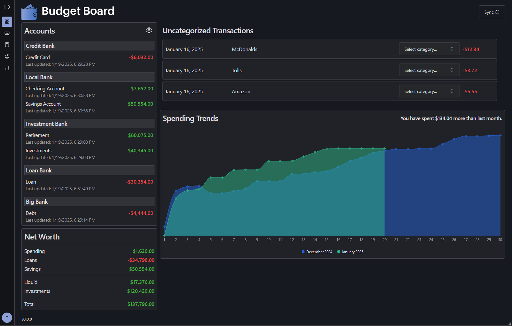
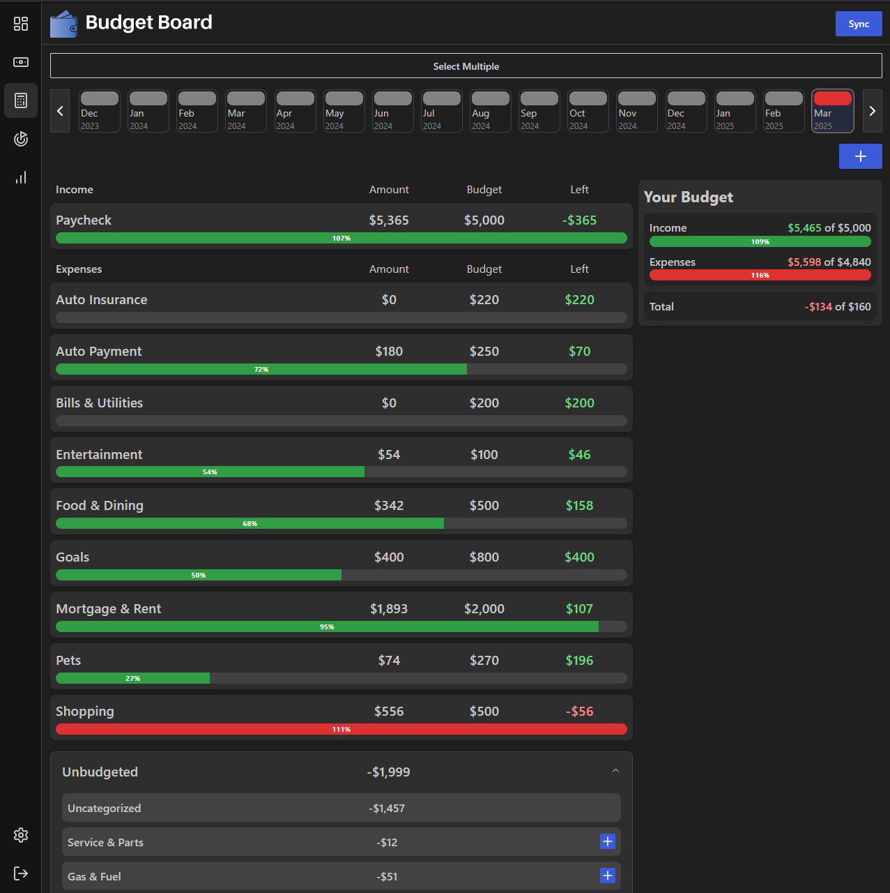

<div align="center" width="100%">
  
</div>

---

[](https://github.com/tshea113/budget-board/actions/workflows/docker-image-ci-build.yml)


A simple app for tracking monthly spending and working towards financial goals.

## About The Project

I created this app to be a self-hosted alternative to the now-shut-down personal finance app Mint.

### Features

- Automatically sync your bank account data with [SimpleFIN](https://www.simplefin.org/)
- Dashboard to view account data at a glance
- Organize transactions into categories and subcategories
- Create monthly budgets for categories and subcategories
- Create and track goals for savings/loan payoff
- Graphs to view trends over time (Spending, Assets, Liabilities, Net Worth, and more)

### Bugs and Feature Requests

Feel free to open an issue if you notice any bugs or have any feature requests!

### Screenshots




## Configuration

### Setting up Docker Compose

This project is deployed using Docker Compose.

The `compose.yml` and `compose.override.yml` files are used to deploy the app.
Both files are able to deploy the app as is, but it is recommended to at least update the database password.

See the [wiki](https://github.com/tshea113/budget-board/wiki/Deploying-via-Docker-Compose) for more details about configuring the compose override file.
### Deploy

Deploy the app by running the following command:

```
docker compose up -d
```

You can now access the app at `localhost:6253`.

Check out the [wiki](https://github.com/tshea113/budget-board/wiki) for more details about configuration and using the app :)
