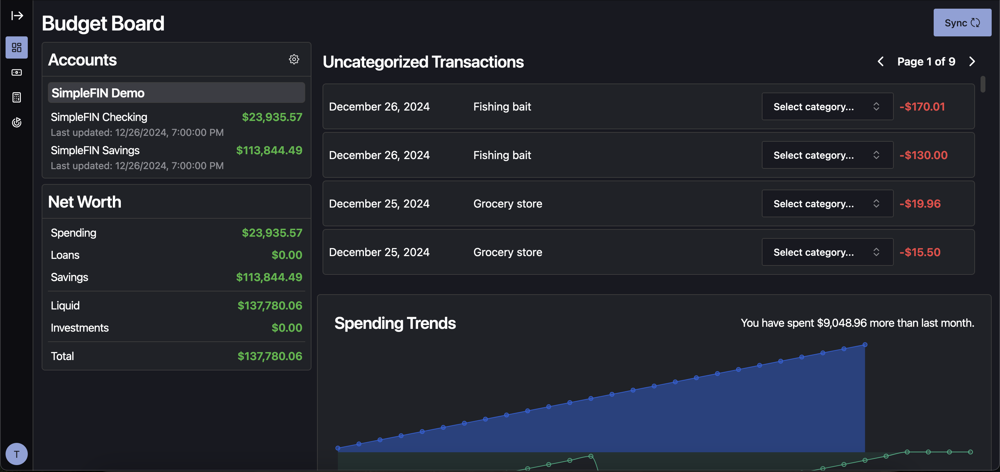
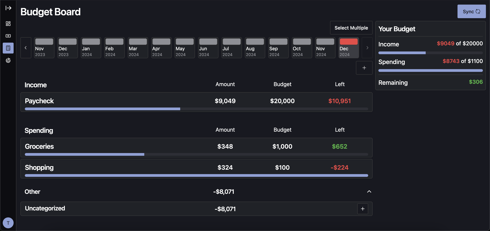
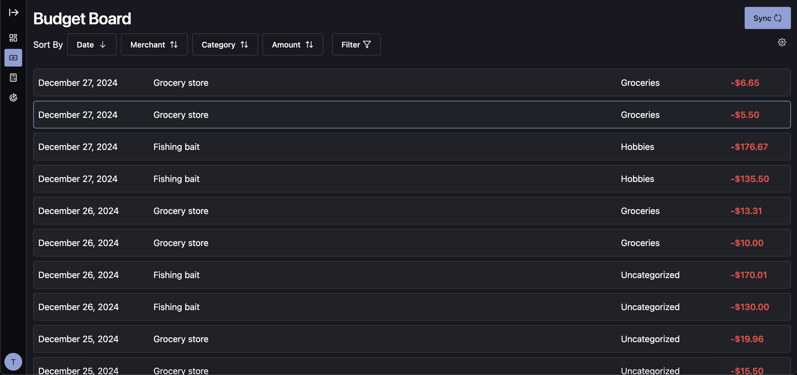
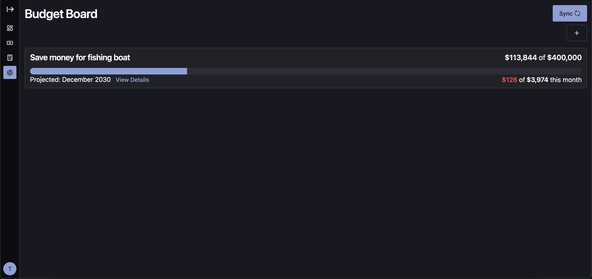

<div align="center" width="100%">
  
</div>

---

[](https://github.com/tshea113/budget-board/actions/workflows/docker-image-ci-build.yml)


A simple and focused app for monthly budgeting and tracking financial goals

> [!WARNING]
> This project is in development!
> Expect breaking changes until v1.0 is released.






## About The Project

I created this app as a replacement for the now shut down app Mint.

It's mostly for my personal use, and such I've ported over most of the features I found most useful.
I'm working towards making this something others can use too, so give it a try!
Still, this is a side project, so development will probably be sporadic.

Feel free to open an issue if you notice any bugs or have any feature requests!

### Configuration

#### Setting up Docker Compose

This project is deployed using Docker Compose.

The `compose.yml` and `compose.override.yml` files are used to deploy the app.
Both files are able to deploy the app as is, but it is recommended to at least update the database password.

Here are some of the configuration options for the different containers:

#### budget-board-server

This container runs the back-end API of the app.

| Option                | Details                                                                                                                                                                                    |
| --------------------- | ------------------------------------------------------------------------------------------------------------------------------------------------------------------------------------------ |
| POSTGRES_HOST         | The host for the PostgreSQL database. You shouldn't need to edit this unless you are hosting your own postgres database.                                                                   |
| POSTGRES_DATABASE     | The postgresql database name. This should match the variable `POSTGRES_DB` under the budget-board-db container.                                                                            |
| POSTGRES_USER         | The postgresql database user that budget board will use to connect to and interact with the database. This should match the variable of the same name under the budget-board-db container. |
| POSTGRES_PASSWORD     | The user password. This should match the variable of the same name under the budget-board-db container.                                                                                    |
| AUTO_UPDATE_DB        | Setting this to true will automatically update the database when the schema changes. Otherwise, you will need to update it manually.                                                       |
| EMAIL_SENDER          | The email address that will send emails for verification, password resets, etc. See Additional Details for more information about setting this up.                                         |
| EMAIL_SENDER_PASSWORD | The password of the email that will send emails for verification, password resets, etc.                                                                                                    |
| EMAIL_SMTP_HOST       | The host server that will send the email.                                                                                                                                                  |
| DISABLE_AUTO_SYNC     | Set true if you would like to disable the SimpleFIN auto-sync feature.                                                                                                                     |

#### budget-board-db

This container hosts a PostgreSQL database used for storing app data. If you have an existing database or wish to use a cloud-based service, you can omit this container from the overrides file.

| Option            | Details                                                                                                                                                                               |
| ----------------- | ------------------------------------------------------------------------------------------------------------------------------------------------------------------------------------- |
| POSTGRES_USER     | The postgresql database user that will be used to connect to and interact with the database. This should match the variable of the same name under the budget-board-server container. |
| POSTGRES_PASSWORD | The user password. This should match the variable of the same name under the budget-board-server container.                                                                           |
| POSTGRES_DATABASE | The postgresql database name. This should match `POSTGRES_DB` in the budget-board-server container.                                                                                   |

### Deploy

Deploy the app by running the following command:

```
docker compose up -d
```

You can now access the app at `localhost:6253`.

## Additional Details

### SimpleFIN Bridge

[SimpleFIN Bridge](https://beta-bridge.simplefin.org/) is a service that allows you to securely share your financial transaction data with apps.
Budget Board can use SimpleFIN Bridge to automatically sync your bank account info and transaction details.
After connecting your accounts in SimpleFIN, you can enter the API key on Budget Board under your account settings.

### Database schema updates

Occasionally the database schema will change and require the database to be updated.
As mentioned above, you can configure this to be automatic using the `AUTO_UPDATE_DB` variable.

> [!WARNING]
> There is a potential for certain updates to result in data loss while the app is still in development.
> If you are concerned about losing data, it is recommended to periodically back up your database and manually apply each database migration.

Here is some information about [manually applying EF Core Migrations](https://learn.microsoft.com/en-us/ef/core/managing-schemas/migrations/applying?tabs=dotnet-core-cli#command-line-tools).

### SMTP Server

You can optionally configure an SMTP server, so that users can receive emails to confirm their accounts and reset passwords.

You can configure this in any way you'd like (self-hosted service, paid cloud service, etc.), but an easy way to do this for a small set of users is to create a gmail account.

If you do want to use a gmail account there are many articles online about how to configure a google account get the gmail smtp access.

> [!WARNING] If you choose to not configure an SMTP server, then users will have no convenient way to recover a lost password.
> You will have to edit the database manually and update with a new hashed password.
